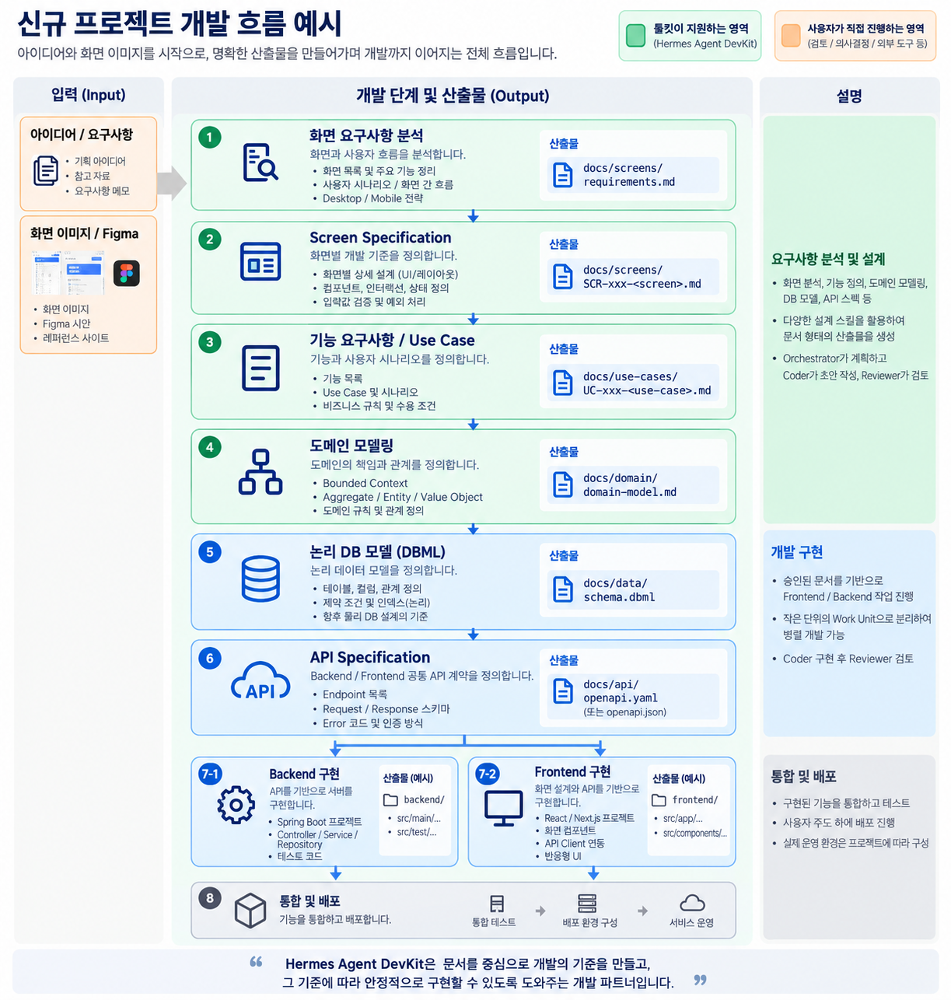

# Hermes Agent DevKit

Windows 11 + Docker Desktop 환경에서 Hermes Agent를 `orchestrator`, `coder`, `reviewer` 멀티 프로필로 운영하기 위한 개발 DevKit입니다.

**모든 새 mutation request의 실행 진입점은 Orchestrator입니다.**  
Orchestrator가 요청을 `DIRECT | STANDARD`로 분류하고, 승인된 작업만 Kanban을 통해 Coder와 Reviewer에게 전달합니다.

```text
User
  ↓
Orchestrator
├─ Direct Flow    작고 명확한 단일 작업
└─ Standard Flow  설계·분해·승인이 필요한 작업
        ↓
      Kanban
        ↓
      Coder
        ↓
     Reviewer
```

> [!IMPORTANT]
> Direct는 구현 단축 경로가 아니라 **Planning 단축 경로**입니다. Direct와 Standard 모두 `Kanban → Coder → Reviewer` 실행 구조를 유지합니다.

---

# 1. 기능 요약

## Multi-Agent Workflow

| Profile | 역할 |
|---|---|
| `orchestrator` | 요구사항 분석, Direct/Standard 분류, 승인 Gate, Work Unit 계획, Kanban Dispatch |
| `coder` | 할당된 Workspace에서 구현, 테스트, 검증 Evidence 생성 |
| `reviewer` | 동일 Workspace의 변경을 독립 검토하고 승인·수정 요청·차단 |

Coder는 새 작업을 직접 시작하거나 self-dispatch하지 않고 **할당된 Kanban Task만 구현**합니다. Reviewer는 source를 직접 수정하지 않습니다.

## Direct / Standard Flow

**Direct Flow**
- 작은 버그 수정
- null / edge case 처리
- 로그·메시지·테스트 보완
- 기존 패턴 기반의 작은 구현 또는 리팩터링
- current workspace / current branch에서 끝낼 수 있는 단일 Work Unit

**Standard Flow**
- 신규 기능
- 화면·도메인·DB·API 설계
- DB Migration
- Infrastructure 변경
- Dependency 변경
- 여러 Module / Repository 영향
- Architecture / Security / Transaction / Concurrency 결정
- 요구사항 해석 또는 승인 경계가 필요한 작업

## Work Unit Boundary

Standard Flow는 하나의 Task가 너무 많은 책임을 가지지 않도록 다음 Work Unit으로 나눕니다.

```text
DESIGN
IMPLEMENTATION
MIGRATION
REFACTOR
AUDIT
```

독립 승인 가능한 설계 산출물이 다음 단계의 입력이 된다면 Task도 분리합니다.

```text
Logical DB Design
        ↓
   DESIGN 완료
        ↓
별도 MIGRATION Task
        ↓
Flyway / Liquibase / Physical Schema
```

---

# 2. 신규 프로젝트 개발 예시

초기 아이디어나 화면 이미지/Figma를 입력으로 받아 **문서화된 설계 기준 → 데이터/API 계약 → Frontend/Backend 구현** 순서로 프로젝트를 발전시킬 수 있습니다.

<p align="center">
  
</p>

이미지의 파일 경로는 전체 흐름을 설명하기 위한 대표 예시입니다. 프로젝트에 기존 문서 convention이 있으면 기존 구조를 우선하며, 별도 convention이 없을 때 현재 DevKit의 기본/권장 산출물은 다음과 같습니다.

| 단계 | 대표 산출물 | 기본/권장 경로 |
|---|---|---|
| 화면 디자인 입력 | 승인 이미지 / Figma Reference | 사용자 입력 또는 기존 디자인 소스 |
| Screen Specification | 화면 목적, 상태, Interaction, Responsive 계약 | `docs/ui/screens/<screen>/screen-spec.md` |
| 화면 Reference Package | 승인 이미지 | `docs/ui/screens/<screen>/reference.png` |
| 기능 요구사항 / Use Case | 기능·Business Rule·Acceptance Criteria | 프로젝트 기존 요구사항 문서 구조 우선 |
| 도메인 모델링 | Context / Aggregate / Entity / Value Object / 책임·관계 | 프로젝트 기존 Domain 문서 구조 우선 |
| 논리 DB 모델 | canonical logical DBML | `docs/data/schema.dbml` |
| API Specification | 사람이 검토하는 Markdown API 계약 | `docs/api/README.md`, `docs/api/<domain>.md` |
| OpenAPI / Swagger | 승인 API 계약과 구현의 API 문서 | 프로젝트 SpringDoc/OpenAPI convention |
| Backend | 현재 Backend Stack의 application / test source (예: Spring Boot) | 대상 프로젝트 기존 source 구조 |
| Frontend | 현재 Frontend Stack의 application / test source (예: React / Next.js) | 대상 프로젝트 기존 source 구조 |

### 예시 개발 순서

```text
초기 이미지 / Figma
        ↓
Screen Specification
        ↓
기능 요구사항 / Use Case
        ↓
도메인 모델링
        ↓
Logical DB Model (DBML)
        ↓
API Specification 승인
        ↓
 ┌──────┴──────┐
 ↓             ↓
Backend      Frontend
 ↓             ↓
 └──────┬──────┘
        ↓
 Integration / Review
        ↓
다음 Work Unit 반복
```

DB 논리 설계와 물리 구현은 같은 Task에서 처리하지 않습니다.

```text
docs/data/schema.dbml
        ↓
  Logical Model 승인
        ↓
별도 Standard MIGRATION
        ↓
Flyway / Liquibase / JPA Physical Mapping
```

API도 먼저 사람이 읽고 검토할 수 있는 Markdown 계약을 승인한 뒤 Backend/Frontend 구현의 공통 기준으로 사용합니다.

```text
docs/api/<domain>.md
        ↓
  Approved API Contract
      ↙          ↘
 Backend       Frontend
      ↘          ↙
    OpenAPI / Review
```

---

# 3. 설치

## 3.1 사전 준비

- Windows 11
- Docker Desktop
- Git
- PowerShell 5.1 이상
- 기본 Host Workspace 예: `D:\workspace`

```powershell
docker version
docker compose version
```

## 3.2 Repository Clone

```powershell
cd D:\workspace
git clone https://github.com/kwang-sub/hermes-agent-devkit.git
cd .\hermes-agent-devkit
git switch dev
```

## 3.3 환경 설정

처음 설치에서만 `sample.env`를 복사합니다.

```powershell
if (Test-Path .env) { throw ".env already exists; update it manually instead of overwriting it." }
Copy-Item sample.env .env
notepad .env
```

최소 설정:

```dotenv
HERMES_DASHBOARD_USERNAME=admin
HERMES_DASHBOARD_PASSWORD=<strong-password>
HERMES_DASHBOARD_SECRET=<long-random-secret>

HERMES_HOST_WORKSPACE_PATH=D:/workspace
HERMES_CONTAINER_WORKSPACE_PATH=/workspace
```

> [!WARNING]
> `.env`, OAuth Token, API Token, Password, Cookie 등 실제 credential은 Git에 Commit하거나 Kanban/로그에 기록하지 않습니다.

## 3.4 Docker 실행

```powershell
docker compose config --quiet
docker compose up -d --build
docker compose ps
```

Dashboard:

```text
http://127.0.0.1:9119
```

Hermes CLI 확인:

```powershell
docker exec --user hermes hermes-dev /opt/hermes/.venv/bin/hermes --help
```

---

# 4. Profile 설정

## 4.1 Profile 초기화

```powershell
.\init-profiles.ps1
```

다음 Profile을 생성하거나 기존 설정을 보정합니다.

```text
orchestrator
coder
reviewer
```

확인:

```powershell
docker exec --user hermes hermes-dev /opt/hermes/.venv/bin/hermes profile list
```

PowerShell 실행 정책에 막히는 경우에만 현재 Session에서:

```powershell
Set-ExecutionPolicy -Scope Process -ExecutionPolicy Bypass
.\init-profiles.ps1
```

## 4.2 Model / OAuth 설정

```powershell
docker exec -it --user hermes hermes-dev /opt/hermes/.venv/bin/hermes -p orchestrator model
docker exec -it --user hermes hermes-dev /opt/hermes/.venv/bin/hermes -p coder model
docker exec -it --user hermes hermes-dev /opt/hermes/.venv/bin/hermes -p reviewer model
```

설정 확인:

```powershell
docker exec --user hermes hermes-dev /opt/hermes/.venv/bin/hermes -p orchestrator config get model --json
docker exec --user hermes hermes-dev /opt/hermes/.venv/bin/hermes -p coder config get model --json
docker exec --user hermes hermes-dev /opt/hermes/.venv/bin/hermes -p reviewer config get model --json
```

### Coder Model Policy

Coder는 실행 전에 논리 등급을 승인받습니다.

```text
DEFAULT | PREMIUM
```

실제 provider/model은 실행 시 resolve되어 Task에 snapshot으로 고정됩니다. Reviewer는 별도 선택 없이 항상 Reviewer Profile의 `DEFAULT`를 사용합니다.

Fallback Provider가 필요한 경우:

```powershell
docker exec -it --user hermes hermes-dev /opt/hermes/.venv/bin/hermes -p orchestrator fallback add
docker exec -it --user hermes hermes-dev /opt/hermes/.venv/bin/hermes -p coder fallback add
```

---

# 5. Capability

작업 영역에 따라 필요한 Skill만 lazy-load합니다.

```text
Backend
├─ Spring Feature
└─ Spring Data

Frontend
└─ Frontend Feature

Data
├─ Data Feature
├─ Data Modeling
└─ DB Migration

Infrastructure
└─ Infrastructure

API
├─ API Specification
├─ API Contract
└─ API Docs / OpenAPI
```

Canonical capability와 Planner → Coder → Reviewer → Preflight 연결은 `custom-skills/shared/capability-lifecycle.json`과 CI에서 검증합니다.


### Stack 확장 정책

Hermes Agent DevKit의 **Workflow, Work Unit, API/Data/Infrastructure/Review 계약은 특정 Framework에 고정하지 않습니다.**

현재 실제 프로젝트에서 사용·검증된 Stack을 우선 지원합니다.

- Backend: Java / Kotlin / Spring Boot 중심
- Frontend: TypeScript / React / Next.js 중심
- Data / API / Infrastructure / Review Workflow는 Stack과 독립적으로 재사용

새로운 Stack은 필요해지는 시점에 다음 흐름으로 추가합니다.

```text
Stack Detection
→ Capability Entry / Hint
→ Coder / Reviewer 연결
→ 실제 프로젝트 검증
```

사용하지 않는 기술의 Skill을 미리 만들지 않고, 실제 프로젝트에서 필요할 때 Capability를 추가하는 방식으로 확장합니다.

---

# 6. DevKit 업데이트

기존 환경에 최신 DevKit과 Hermes Runtime을 반영합니다.

```powershell
.\update-devkit.ps1
```

기본 흐름:

```text
Git fast-forward
→ 최신 Hermes base image 검증
→ Docker build
→ Container recreate
→ Profile reconcile
→ Runtime verification
→ Git / GitHub 설정 확인
```

`hermes-dev-data` volume은 유지되므로 일반 업데이트에서는 Profile / OAuth / Session / Kanban 상태가 보존됩니다.

---

# 7. 검증

Repository 전체 회귀 검증:

```bash
bash scripts/verify.sh
```

주요 검증 범위:

- Direct Flow contract
- Standard Work Unit contract
- Capability Lifecycle
- Infrastructure Capability
- Coder / Reviewer Review Cycle
- Model Policy / Notification
- Gradle Verification / Evidence Reuse
- Git Publish / Workspace Cleanup
- DevKit updater contract
- `update-devkit.ps1` PowerShell syntax
- Latest Hermes compatibility

GitHub Actions에서도 동일한 핵심 계약을 지속적으로 검증합니다.

---

# 8. 작업 완료와 Git Publication

정상적인 구현/리뷰 완료 상태:

```text
Kanban Task = done
Workspace = 유지
Working Tree = 미커밋 변경이 남을 수 있음
```

구현 Workflow는 자동으로 다음 작업을 수행하지 않습니다.

```text
commit
push
PR
merge
workspace cleanup
```

필요한 경우 별도 Git Workflow를 사용합니다.

```text
git-pr-publish
→ 사용자 Merge
→ git-workspace-cleanup
```

---

# 9. 사용 가이드

**개발 작업 요청은 Orchestrator에 입력합니다.**

```powershell
docker exec -it --user hermes hermes-dev /opt/hermes/.venv/bin/hermes -p orchestrator chat
```

Orchestrator가 요청을 `DIRECT | STANDARD`로 분류합니다.

예:

```text
/workspace/sample-api 프로젝트에서
UserService의 null 입력 시 발생하는 오류를 수정해주세요.
정상 입력 동작은 유지하고 관련 테스트도 확인해주세요.
```

## 9.1 Direct Flow

작고 범위가 명확한 단일 구현/리팩터링을 위한 경량 Planning Flow입니다.

```text
User
→ Orchestrator
→ Direct eligibility
→ 실행 방식 선택
→ Coder Model 선택
→ Compact Plan 승인
→ Kanban
→ Coder
→ Reviewer
```

대표 조건:

- managed 단일 Project
- current workspace / current branch
- `IMPLEMENTATION | REFACTOR`
- `SINGLE_UNIT`
- API Spec Gate 불필요
- Infrastructure 영향 없음
- 기존 패턴으로 해결 가능
- bounded targeted verification 가능

실제 Source에서 Direct 범위를 넘는 변경이 필요해지면 Coder가 임의로 확대하지 않고 다음 상태로 Block합니다.

```text
DIRECT_SCOPE_EXCEEDED
Required Flow: STANDARD
```

Orchestrator가 Standard Flow 또는 Requirement Delta로 다시 계획합니다.

## 9.2 Standard Flow

설계·분해·승인 또는 복합 영향 분석이 필요한 작업입니다.

```text
Request
→ Project Resolve / Approval
→ Bootstrap (필요 시)
→ Breakdown
→ Work Unit Boundary
→ API Spec Gate (필요 시)
→ Workspace / Branch Approval
→ Coder Model Approval
→ Plan Approval
→ Kanban
→ Coder
→ Reviewer
```

대표 대상:

- 신규 기능
- Screen / Domain / API / Data 설계
- DB Migration
- Infrastructure 변경
- Dependency 변경
- 여러 Module / Repository
- Architecture / Security / Transaction / Concurrency 결정

**Direct와 Standard 모두 동일 Review loop를 사용합니다.**

```text
Coder
  ↓ kanban_request_review
Reviewer DEFAULT
  ├─ APPROVED → done
  ├─ CHANGES_REQUESTED → original coder → re-review
  └─ BLOCKED → human / external input
```

사용자가 명시적으로 Flow를 지정할 수도 있지만 eligibility를 우회하지 않습니다.

```text
Direct Flow로 진행해주세요.
Standard Flow로 진행해주세요.
```

---

# 10. 주요 디렉터리

```text
hermes-agent-devkit
├─ custom-skills/
│  ├─ orchestrator/
│  │  ├─ dev-direct-flow/
│  │  ├─ dev-workflow-orchestrate/
│  │  ├─ dev-breakdown/
│  │  └─ dev-workspace-dispatch/
│  ├─ coder/
│  │  ├─ dev-implement-plan/
│  │  └─ dev-review-cycle/
│  ├─ reviewer/
│  │  ├─ dev-code-review/
│  │  └─ dev-review-cycle/
│  └─ shared/
│     └─ capability skills
├─ shared/
├─ scripts/
├─ docs/images/
├─ Dockerfile
├─ compose.yml
├─ init-profiles.ps1
└─ update-devkit.ps1
```

---

# 11. 운영 시 주의사항

## Volume

일반 종료:

```powershell
docker compose down
```

다음 명령은 **완전 초기화**입니다.

```powershell
docker compose down -v
```

`-v`를 사용하면 Profile, OAuth, Session, Memory, Kanban 등 Hermes Runtime 데이터가 삭제될 수 있습니다.

## Git 변경 보호

Agent는 기존 사용자 변경을 보존합니다. 명시적인 승인 없이 다음 작업을 수행하지 않습니다.

```text
git reset
git restore
git clean
git stash
commit
push
PR
merge
```

---

## 핵심 원칙

```text
새 개발 요청
    ↓
Orchestrator
    ↓
DIRECT | STANDARD
    ↓
Kanban
    ↓
Coder
    ↓
Reviewer
    ↓
done / blocked
```

Hermes Agent DevKit은 설계 문서와 명시적인 작업 계약을 중심으로 개발 기준을 만들고, 그 기준에 따라 작은 Work Unit을 안정적으로 구현·검토하기 위한 개발 Workflow를 제공합니다.
